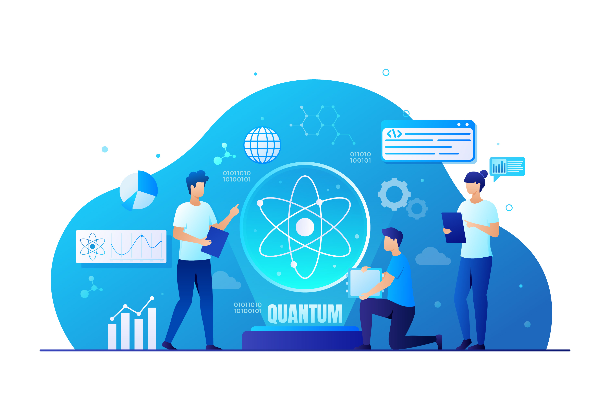

# 🚀 React Odyssey: The Complete Hands-on Journey

> More than a projects repository — this is my React developer journey, in public.

React Odyssey is a hands-on, intensive journey through the modern React ecosystem. Inside, you'll find real-world projects, practical exercises, and interactive mini live demos organized by topic, tools, and skill level.

This repository is not just a collection of practice code — it's a public log of my growth as a frontend developer with React.

## Live Demos

Every project or exercise relevant includes a mini live demo to explore, test, and get inspired.

[Coming soon: Production demo index page]

## What's Included?
-   400+ hours of intensive React.js training.
-   Modern UI technologies and architecture patterns.
-   Mini apps and exercises with live demos.
-   From UI thinking to systems thinking.

## Table of Content:

- [React Foundations](react-foundation/README.md)
- [React Hooks](react-hooks/README.md)
- [Beginner React + Javascript projects](project-demos/README.md)

## Main Content.

This repository contains a comprehensive collection of practical exercises and real-world projects focused on React, using both JavaScript and TypeScript. 

It covers core concepts such as components, hooks, state management, effects, events, and modern form handling with validation and UX/UI best practices. It emphasizes TypeScript best practices, including typed props and custom hooks. You'll also find essential tools and libraries like Tailwind CSS, DaisyUI, ShadcnUI, and Radix UI. For state management, it includes custom hooks, Zustand, and Redux Toolkit. Animations are handled with Framer Motion, and routing/data fetching is explored with TanStack Router, Query, and Start. The repository also includes testing strategies with React Testing Library, design patterns, design systems, and architectural thinking applied to real projects. Additionally, it features Next.js with App Router, server-side rendering (SSR), and more.

## Purpose

> Learn by doing. This journey is designed to

* Strengthen my expertise as a UI/Frontend Engineer
* Deeply explore the modern React ecosystem
* Document every step with working examples and visual demos
* Build a strong foundation for real-world, professional projects

## Status

This project is a constant work in progress. Feel free to follow the journey.

All content is hand-crafted from scratch as part of a real, progressive learning process.